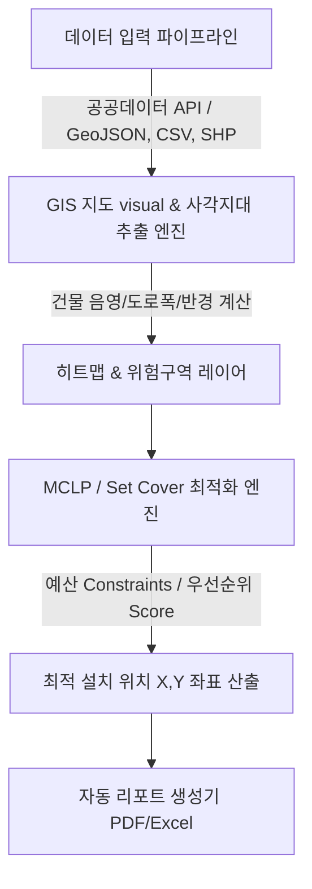
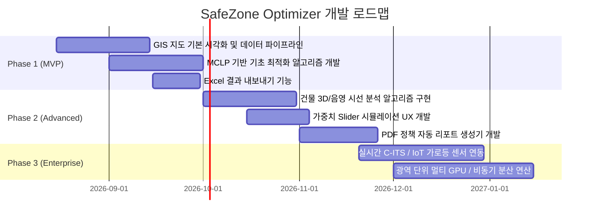

# [PRD] SafeZone Optimizer: GIS 기반 CCTV & 가로등 최적 배치 추천 솔루션

---

## 📋 문서 제어 (Document Control)

| 항목 | 내용 |
| :--- | :--- |
| **문서명** | SafeZone Optimizer 제품 요구사항 정의서 (Product Requirement Document) |
| **버전** | v1.0.0 |
| **작성일자** | 2026-08-04 |
| **대상 독자** | 기획팀 (PO/PM), 개발팀 (Frontend, Backend, GIS Engine, Data Science), 디자인팀 (UI/UX), 지자체 관계자 |
| **문서 상태** | Draft (초안 승인 대기) |

---

## 1. 제품 개요 (Product Overview)

### 1.1 제품명 (Tentative Name)
**SafeZone Optimizer** (GIS 기반 CCTV & 가로등 최적 배치 추천 솔루션)

### 1.2 핵심 목적 (Core Purpose)
* **공간 데이터 분석 자동화**: 지도 데이터(GIS), 도로망, 건물 3D/음영 데이터, 범죄 통계, 기존 보안 시설물 위치를 종합 분석하여 사각지대 및 위험 구역을 시각적으로 자동 추출합니다.
* **비용 대비 효과 극대화**: 제한된 지자체 예산 하에서 사각지대를 최대한 해소하는 설치 지점($X, Y$ 좌표)을 **수학적 최적화 알고리즘(MCLP / Set Cover Problem)**을 통해 산출합니다.
* **의사결정 지원 리포트 생성**: 데이터 분석 결과를 지자체 의회, 심의위원회, 시공 담당자가 즉시 활용할 수 있는 **PDF 및 Excel 형식의 자동 리포트**로 생성합니다.

### 1.3 해결하려는 문제 (Problem Statement)
1. **주구난방식 시설물 설치**: 민원 위주의 우선 설치로 인해 실제 범죄 고위험군 및 도로폭 대비 보안 취약 지역의 사각지대가 지속 발생.
2. **분석 프로세스의 비효율성**: 담당 공무원 및 분석가가 QGIS 등 복잡한 툴로 수동 조작을 거쳐 분석하는 데 수주일 이상 소요.
3. **예산 효율성 증명 난항**: 특정 지점 설치 시 "사각지대 해소율(%)" 및 "비용 대비 효과"를 객관적 수치로 제시하기 어려움.

### 1.4 핵심 가치 제안 (Value Proposition)
* **정량적 의사결정**: 최적화 알고리즘 기반 스코어링 시스템을 통한 객관적 설치 우선순위 제공.
* **업무 시간 단축**: 데이터 업로드부터 사각지대 분석, 알고리즘 추론, 리포트 출력까지 단 5분 이내 완료.
* **예산 절감 효과**: 동일 예산 대비 사각지대 해소 면적 최대 35% 이상 향상.

---

## 2. 사용자 페르소나 및 유즈케이스 (User Personas & Use Cases)

### 2.1 주요 사용자 페르소나

#### Persona A: 지자체 도시안전/CCTV 담당 공무원 (김서연 팀장)
* **Goal**: 한정된 연간 예산(예: 3억 원) 내에서 신규 CCTV 15대, 가로등 30대를 어디에 설치해야 치안 효과가 가장 큰지 신속히 판단하고 정책 승인을 받아야 함.
* **Pain Point**: 전문 GIS 기술이 부족하여 사각지대 파악이 어렵고, 민원 요청 지역과 실제 위험 지역 간의 갈등 해결이 난감함.

#### Persona B: GIS 및 도시 데이터 분석가 (박현우 연구원)
* **Goal**: 다양한 공공데이터(SHP, GeoJSON, CSV) 및 도로 폭, 건물 높이 데이터를 레이어별로 결합하여 정밀한 위치 추론 파이프라인 구축.
* **Pain Point**: 매번 수동으로 파이썬 스크립트나 QGIS 연산을 수행하고 결과를 재가공하는 단순 반복 작업 부담.

---

## 3. 핵심 기능 요구사항 (Core Feature Specifications)



---

### 3.1 GIS 지도 기반 데이터 시각화 & 사각지대 추출

#### (1) 데이터 파이프라인 및 연동 (Data Ingestion & Integration)
* **공공데이터 자동 연동 API**:
  * 공공데이터포털(data.go.kr) / V-World OpenAPI 지원 (전국 CCTV 위치, 가로등 위치, 도로망 데이터, 어린이 보호구역 등).
* **사용자 파일 업로드 기능**:
  * 지원 포맷: `GeoJSON`, `CSV` ($X, Y$ 좌표 또는 주소 포함), `SHP` (Zip 압축 형태).
  * 좌표계 자동 변환 (EPSG:4326/WGS84, EPSG:5181/GRS80, EPSG:5179/UTM-K 간의 자동 Projection 지원).
  * 데이터 유효성 검증 (Validation): 필수 컬럼(위도, 경도, 시설물 분류) 누락 시 에러 가이드 제공.

#### (2) 사각지대 및 위험구역 분석 알고리즘 (Blind Spot & Risk Analysis)
* **CCTV / 가로등 커버리지 모델링**:
  * **CCTV**: 화각(Angle of View, 예: 90°~120°), 유효 감지 거리를 고려한 부채꼴(Sector) 및 반경(Buffer Circle, 예: 30m/50m) 공간 폴리곤 생성.
  * **가로등**: 조도 반경(예: 15m Buffer Circle) 설정.
* **건물 음영(Shadowing) 및 구조물 차폐 연산**:
  * 건물 3D/2D 레이어(SHP/GeoJSON)와의 교차 검증(Difference / Spatial Intersection).
  * 시선 분석(Line of Sight Analysis): 건물 벽면에 가려지는 은폐 구역 자동 사각지대 처리.
* **도로폭 대비 보안 시설 부족도 산출**:
  * 도로망 데이터(LineString) 폭(Width) 속성 분석.
  * 도로 폭이 넓으나 기존 CCTV/가로등 밀도가 낮은 구간에 가중치($W_{road}$) 부여.
* **동적 히트맵 시각화**:
  * Deck.gl 또는 Leaflet/Mapbox 기반 60fps 부드러운 히트맵 렌더링.
  * 사각지대 밀도, 범죄 위험도, 야간 어두움 지수를 레벨별(Green $\rightarrow$ Yellow $\rightarrow$ Red) 표현.

---

### 3.2 최적 배치 알고리즘 엔진 (Optimization Engine)

#### (1) 수학적 모델링 및 목적 함수 (Mathematical Formulation)

최적화 문제는 **최대 커버리지 위치 문제 (Max Coverage Location Problem, MCLP)** 및 **집합 커버 문제 (Set Cover Problem)**를 혼합 적용합니다.

##### [MCLP 기반 목적 함수]
예산 범위 내에서 전체 위험/사각지대 중 커버되는 총 가중치 합을 최대화합니다.

$$\max \sum_{i \in I} w_i \cdot y_i - \sum_{j \in J} c_j \cdot x_j$$

* **Variables & Parameters**:
  * $I$: 사각지대/위험 수요 지점(Demand Points) 집합
  * $J$: 신규 CCTV/가로등 후보 지점(Candidate Locations) 집합
  * $w_i$: 수요 지점 $i$의 종합 위험도/우선순위 스코어 ($Score_i$)
  * $y_i \in \{0, 1\}$: 지점 $i$가 하나 이상의 신규/기존 시설에 의해 커버되면 1, 아니면 0
  * $x_j \in \{0, 1\}$: 후보지 $j$에 시설물을 설치하면 1, 아니면 0
  * $c_j$: 후보지 $j$의 설치 비용 (단가)
  * $B$: 총 가용 예산 (Total Budget Constraint)

##### [제약 조건 (Constraints)]
1. **예산 제약**: $\sum_{j \in J} c_j \cdot x_j \le B$
2. **커버리지 조건**: $y_i \le \sum_{j \in N_i} x_j \quad \forall i \in I$ (여기서 $N_i$는 지점 $i$를 커버할 수 있는 후보지 $j$의 집합)
3. **최대 설치 개수 제약** (필요시): $\sum_{j \in J} x_j \le N_{max}$

---

#### (2) 설치 우선순위 Score 산정 공식

각 지점 $i$의 종합 설치 필요성 스코어($Score_i$)는 다음 가중합으로 계산됩니다.

$$Score_i = \left( \alpha \cdot \overline{R_{width}} \right) + \left( \beta \cdot \overline{C_{crime}} \right) + \left( \gamma \cdot \overline{A_{blind}} \right) + \left( \delta \cdot \overline{P}_{pop} \right)$$

| 변수 | 의미 | 설명 | 기본 가중치 |
| :--- | :--- | :--- | :--- |
| $\overline{R_{width}}$ | 도로폭 정규화값 | 도로 폭이 넓거나 위험도가 높은 구간 | 0.3 |
| $\overline{C_{crime}}$ | 범죄/치안 위험도 정규화값 | 5대 범죄 발생 통계 및 여성안심귀가길 지정 여부 | 0.3 |
| $\overline{A_{blind}}$ | 사각지대 면적 정규화값 | 주변 미커버 사각지대 면적 비율 | 0.25 |
| $\overline{P_{pop}}$ | 유동/유아 인구 정규화값 | 어린이보호구역, 유동인구 데이터 연동 | 0.15 |

* 사용자/분석가가 UI 상에서 가중치($\alpha, \beta, \gamma, \delta$)를 직접 Slider로 조절하여 시뮬레이션할 수 있는 기능을 제공합니다 ($\alpha + \beta + \gamma + \delta = 1.0$).

---

#### (3) 시뮬레이션 인터페이스
* **파라미터 설정**:
  * 예산 한도 ($B$), 신규 설치 가능 대수 제한.
  * 시설물 유형 선택 (CCTV, 가로등, 융합형 보안등).
  * CCTV 화각 및 감지거리 (30m, 50m, 70m).
* **실시간 계산 및 결과 비교**:
  * '최적화 실행' 버튼 클릭 시 PuLP / SciPy / OR-Tools 엔진을 가동하여 3초 이내 좌표 추출.
  * 기존 커버리지 vs 최적화 후 커버리지 비교(Before & After) 통계 수치 및 맵 레이어 표출.

---

## 4. 시스템 아키텍처 및 기술 스택 (System Architecture & Tech Stack)

> [!IMPORTANT]
> 본 시스템은 **순수 클라이언트 사이드(Vanilla JavaScript) 단일 페이지 앱(SPA)**으로 구현됩니다. 백엔드 서버 및 데이터베이스 접근 없이, 모든 공간 연산·최적화 알고리즘·리포트 생성이 브라우저 내에서 직접 실행됩니다.

### 4.1 전체 아키텍처 Diagram

```
[Client (Web Browser) — 단일 실행 환경, 서버/DB 없음]
  │
  ├── [UI Layer] HTML5 + Vanilla JavaScript (ES2022+) + CSS3
  │     └── 3-Pane 레이아웃 (Control Panel / GIS Map / Analytics)
  │
  ├── [GIS & Visualization Layer]
  │     ├── Leaflet.js  — 인터랙티브 지도 렌더링 (벡터 타일, 마커, 폴리곤)
  │     └── Leaflet.heat / Canvas API — 사각지대 히트맵 오버레이
  │
  ├── [Spatial Processing Layer — 브라우저 내 순수 JS 연산]
  │     ├── Turf.js    — 버퍼, 교차 분석, 면적 계산, 공간 통계
  │     └── Proj4.js   — EPSG 좌표계 변환 (WGS84 / GRS80 / UTM-K)
  │
  ├── [Optimization Engine Layer — 브라우저 내 JS 구현]
  │     └── MCLP / Greedy Set Cover 알고리즘 (순수 Vanilla JS 구현)
  │
  ├── [Data I/O Layer — 파일 기반, 서버 없음]
  │     ├── FileReader API  — GeoJSON, CSV 드래그앤드롭 업로드
  │     ├── shpjs           — Shapefile(.zip) → GeoJSON 브라우저 내 변환
  │     └── localStorage / sessionStorage — 세션 내 분석 결과 임시 저장
  │
  └── [Report Export Layer]
        ├── jsPDF + html2canvas — PDF 보고서 클라이언트 사이드 생성
        └── SheetJS (xlsx.js)  — Excel(.xlsx) 클라이언트 사이드 생성
```

### 4.2 확정 기술 스택 (Vanilla JS 기반)

| 구분 | 기술 스택 | 버전(권장) | 선정 사유 |
| :--- | :--- | :--- | :--- |
| **Core Language** | Vanilla JavaScript (ES2022+) | — | 프레임워크 의존성 없음, 빠른 초기 로드 |
| **마크업/스타일** | HTML5, CSS3 (Vanilla CSS) | — | 외부 CSS 프레임워크 없이 완전 제어 |
| **GIS 지도 렌더링** | Leaflet.js | v1.9.x | 경량(42KB), 오픈소스, 플러그인 생태계 풍부 |
| **히트맵 오버레이** | Leaflet.heat | v0.2.x | Leaflet 플러그인으로 간단한 히트맵 생성 |
| **공간 연산** | Turf.js | v6.x | 브라우저 내 GeoJSON 기반 공간 분석 라이브러리 |
| **좌표계 변환** | Proj4.js | v2.x | EPSG 간 좌표 변환 (WGS84 ↔ GRS80 ↔ UTM-K) |
| **SHP 파일 파싱** | shpjs | v4.x | 브라우저에서 Shapefile Zip을 GeoJSON으로 변환 |
| **PDF 출력** | jsPDF + html2canvas | v2.x / v1.x | 서버 없이 브라우저에서 직접 PDF 생성 |
| **Excel 출력** | SheetJS (xlsx) | v0.18.x | 클라이언트에서 .xlsx 파일 직접 생성 |
| **통계 차트** | Chart.js | v4.x | 경량 캔버스 기반 차트 라이브러리 |
| **데이터 임시 저장** | localStorage / sessionStorage | Browser API | DB 없이 세션 내 분석 결과 유지 |

---

## 5. 클라이언트 사이드 데이터 모델 (In-Memory Data Model)

> [!NOTE]
> 데이터베이스 접근 없이 모든 데이터는 **브라우저 메모리(JS 변수)** 와 **localStorage**에서 관리됩니다. 페이지 새로고침 시 세션 데이터는 유지되며, 분석 완료 후 결과는 JSON 파일로 내보낼 수 있습니다.

### 5.1 핵심 JS 인메모리 데이터 구조

#### `CctvFeature` (CCTV 시설물 오브젝트)
```javascript
// GeoJSON Feature 포맷 — Turf.js와 완전 호환
{
  type: "Feature",
  geometry: { type: "Point", coordinates: [126.978, 37.566] }, // [lng, lat]
  properties: {
    id: "cctv-001",           // 관리번호
    camera_angle: 120,         // 화각 (도)
    view_distance: 50,         // 감지 반경 (m)
    address: "서울특별시 중구...", // 도로명 주소
    install_year: 2022,        // 설치 연도
    source: "upload" | "api"   // 데이터 출처
  }
}
```

#### `OptimizationSession` (최적화 세션 오브젝트 — localStorage 저장)
```javascript
{
  sessionId: "sess-20260804-001",  // 세션 식별자
  createdAt: "2026-08-04T12:00:00Z",
  params: {
    budget: 300000000,
    costPerUnit: 15000000,
    facilityType: "CCTV",  // "CCTV" | "LAMP" | "COMBINED"
    viewDistance: 50,
    cameraAngle: 120,
    weights: {
      roadWidth: 0.3,
      crimeRisk: 0.3,
      blindArea: 0.25,
      population: 0.15
    }
  },
  result: {
    recommendations: [          // 추천 설치 지점 배열
      {
        rank: 1,
        lat: 37.5665, lng: 126.9780,
        address: "서울특별시 중구 세종대로 110 인근",
        priorityScore: 94.2,
        estimatedCost: 15000000,
        coveredBlindAreaSqm: 1450.5
      }
    ],
    metrics: {
      totalBudgetUsed: 285000000,
      totalInstalled: 19,
      blindzoneResolutionRate: 84.6  // (%)
    }
  }
}
```

### 5.2 데이터 흐름 (No-Server Flow)

```
[파일 업로드 / 공공API URL 입력]
        │
        ▼
[FileReader API / fetch()로 GeoJSON·CSV·SHP 로드]
        │
        ▼ (shpjs: SHP→GeoJSON 변환, PapaParse: CSV 파싱)
[인메모리 GeoJSON FeatureCollection 저장 (JS 변수)]
        │
        ▼ (Turf.js 공간 연산)
[사각지대 폴리곤 계산 → Leaflet 지도 레이어 렌더링]
        │
        ▼ (MCLP Greedy 알고리즘, 순수 JS)
[최적 설치 좌표 배열 계산]
        │
        ├──→ [localStorage 세션 저장]
        ├──→ [Leaflet 마커 지도 표출]
        ├──→ [Chart.js 통계 차트 업데이트]
        └──→ [jsPDF / SheetJS 리포트 다운로드]
```

---

### 5.3 주요 JS 모듈 함수 인터페이스

> [!NOTE]
> 서버 호출 없이 모든 연산이 브라우저 내 JS 함수 호출로 처리됩니다. 각 모듈은 독립 `.js` 파일로 분리합니다.

#### `dataLoader.js` — 파일 업로드 및 파싱 모듈
```javascript
// GeoJSON / CSV / SHP 파일을 읽어 표준 GeoJSON FeatureCollection 반환
async function loadFile(file)           // → FeatureCollection
async function fetchPublicAPI(url)      // 공공데이터 API URL → FeatureCollection
function detectAndConvertCRS(fc)        // 좌표계 자동 감지 후 WGS84 변환 → FeatureCollection
```

#### `spatialEngine.js` — 공간 연산 모듈 (Turf.js 래퍼)
```javascript
// CCTV 커버리지 부채꼴 폴리곤 생성 (화각, 감지거리 적용)
function buildCoveragePolygon(cctvFeature)  // → GeoJSON Polygon (Sector)
// 전체 도로망에서 커버되지 않은 사각지대 폴리곤 계산
function calcBlindZones(roadLayer, coverageUnion)  // → FeatureCollection
// 각 후보지점 우선순위 스코어 산출
function calcPriorityScore(candidate, weights)     // → Number (0~100)
```

#### `optimizer.js` — MCLP 최적화 알고리즘 모듈
```javascript
// Greedy MCLP: 예산 내 사각지대 최대 해소 지점 산출
function runMCLP(params) {
  // params: { candidatePoints, demandPoints, budget, costPerUnit, weights }
  // → { recommendations: [...], metrics: { totalInstalled, blindzoneResolutionRate, ... } }
}
```

#### `reportExporter.js` — 리포트 내보내기 모듈
```javascript
// 분석 결과를 PDF로 브라우저 다운로드
function exportPDF(sessionResult, mapElement)  // → void (파일 다운로드 트리거)
// 분석 결과를 .xlsx로 브라우저 다운로드
function exportExcel(sessionResult)            // → void (파일 다운로드 트리거)
// 결과를 JSON 파일로 내보내기 (세션 백업)
function exportJSON(sessionResult)             // → void (파일 다운로드 트리거)
```

---

## 6. UI/UX 화면 구성 및 사용자 흐름 (UI/UX Specification)

### 6.1 메인 레이아웃 (3-Pane Architecture)
1. **Left Sidebar (Control Panel)**:
   * 레이어 선택 (기존 CCTV, 가로등, 도로망, 사각지대 히트맵, 어린이 보호구역 ON/OFF).
   * 알고리즘 파라미터 (예산 입력, Slider 가중치 조절, 설비 선택).
   * 최적화 실행 버튼 & 진행 상태 프로그레스 바.
2. **Center Section (Interactive GIS Map View)**:
   * Mapbox/Leaflet 베이스맵 (위성 지도 / 일반 지도 / 야간 모드 지도).
   * 사각지대 히트맵 Overlay.
   * 추천 설치 지점 핀 마커 (순위 뱃지 표시) 및 사각지대 해소 예상 영역 반경 가시화.
   * 핀 클릭 시 상세 팝업 (추천 사유, 도로폭, 주변 범죄 지수).
3. **Right Collapsible Panel (Analytics & Report)**:
   * 실시간 통계 차트 (기존 사각지대 vs 설치 후 사각지대 % 변화 도넛 차트).
   * 설치 추천 지점 Top N 테이블.
   * [PDF 보고서 다운로드], [Excel 다운로드] Quick Action 버튼.

---

## 7. 비기능 요구사항 (Non-Functional Requirements)

### 7.1 성능 및 응답 시간 (Performance & Scalability)
* **지도 렌더링 성능**: 10,000개 이상의 공간 객체 표출 시에도 60fps 이상의 FPS 유지 (Vector Tiles 및 WebGL 사용).
* **알고리즘 연산 속도**: 반경 5km 이내 행정동 단위 최적화 문제 산출 시 **5초 이내** 응답 완료.
* **대용량 연산 처리**: 10km 이상 광역 단위 연산 요청 시 Celery 비동기 태스크로 전환 및 웹소켓(WebSocket)으로 진척도(%) 전달.

### 7.2 데이터 정확성 및 호환성 (Accuracy & Compatibility)
* **좌표계 변환 오차**: EPSG 간 변환 오차 범위 1m 이내 보장.
* **표준 포맷 지원**: OGC(Open Geospatial Consortium) 표준 GeoJSON 및 Shapefile 완전 호환.

### 7.3 보안 및 접근 제어 (Security & Access Control)
* **RBAC (Role-Based Access Control)**:
  * 지자체 관리자: 본인 관할 구역 데이터 조회 및 최적화 실행 권한.
  * 시스템 관리자: 공공데이터 배치 업데이트 및 사용자 권한 관리.
* **데이터 보안**: 지자체 내부 업로드 데이터(민감 범죄 통계 등)는 SSL/TLS 1.3 암호화 전송 및 데이터베이스 이중 암호화.

---

## 8. 단계별 개발 로드맵 (Release Roadmap)



### Phase 1: MVP (Minimum Viable Product) - *Target: 2개월 이내*
* 공공데이터 API 연동 및 기본 2D 사각지대 Buffer 시각화.
* 기초 MCLP 알고리즘 연동 ($X,Y$ 좌표 산출).
* Excel 추천 목록 다운로드 지원.

### Phase 2: Commercial Release - *Target: 4개월 이내*
* 건물 음영 및 도로폭 자동 가중치 레이어 반영.
* 파라미터 조절 시뮬레이션 3-Pane UI 구축.
* PDF 지자체 심의 제출용 완제 보고서 자동 추출.

### Phase 3: Enterprise Enhancement - *Target: 6개월 이내*
* C-ITS 및 실시간 유동인구 API 연동.
* 광역 지자체 멀티 처리 분산 처리 아키텍처 지원.

---

## 9. 성공 지표 (KPIs) 및 위험 요소 (Risks & Mitigation)

### 9.1 핵심 성과 지표 (KPIs)
1. **분석 업무 처리 시간**: 기존 평균 5일 $\rightarrow$ **10분 이내 단축 (99% 감소)**.
2. **동일 예산 대비 사각지대 해소율**: 무작위/민원 기반 설치 대비 **최적화 설치 시 해소율 +30% 이상 증가**.
3. **리포트 발행 건수 및 사용자 재방문율**: 지자체 사용자의 월간 리포트 추출 건수 및 유저 retention rate 70% 이상.

### 9.2 위험 요소 및 대응 방안 (Risks & Mitigation)

| 위험 요소 | 영향도 | 대응 방안 (Mitigation) |
| :--- | :--- | :--- |
| **공공데이터 좌표계 오류/누락** | High | 업로드 시 좌표계 자동 감지(Auto-detect) 및 유효성 검증 파이프라인 구성 |
| **대용량 GIS 연산 병목** | High | R-Tree / Spatial Indexing 적용 및 Celery+Redis 비동기 백그라운드 연산 분리 |
| **민원 설치 요구와의 충돌** | Medium | 최적화 결과에 민원 우선 지점을 Constrained Candidate로 강제 포함할 수 있는 옵션 제공 |

---

> **본 PRD 문서는 개발팀 및 기획팀의 피드백을 수렴하여 지속적으로 업데이트됩니다.**
